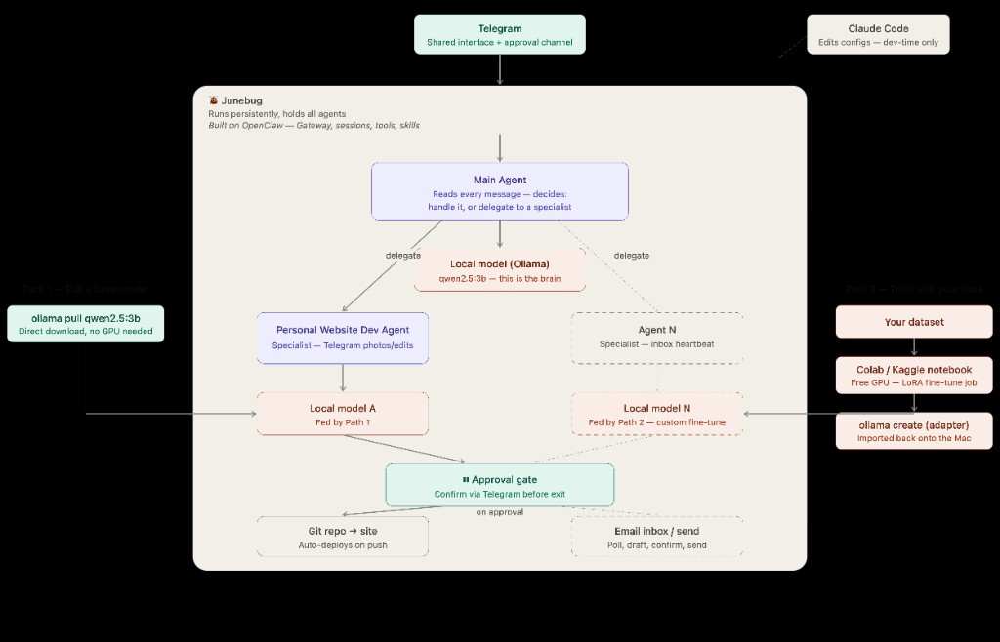

# Junebug



Junebug is a local-first multi-agent assistant built on OpenClaw. Telegram is the primary interface, the Main Agent handles incoming requests and delegates work to specialist agents, and every action that changes something outside the machine (like pushing code or sending email) requires explicit approval. All inference runs locally through Ollama on a home Mac—no cloud APIs required for v1.

**Roadmap:** [roadmap.md](roadmap.md)

---

## Why Junebug?

Most personal AI assistants are built around a single cloud-hosted model. Junebug takes a different approach: a persistent, local-first system where specialized agents work together through OpenClaw, run entirely on consumer hardware, and ask for approval before making changes outside the machine.

The long-term goal is to build a personal AI system that's modular, private, and easy to extend as new agents are added.

---

## Architecture

The diagram above shows the long-term architecture. Components shown with dashed outlines are planned for future releases and are not part of the current implementation.

| Component | Role |
| --- | --- |
| **Telegram** | User interface and approval channel |
| **OpenClaw Gateway** | Routes requests between agents, manages sessions, and enforces access rules |
| **Main Agent** (`main`) | Default entry point. Chats with the user and decides whether to handle a request or delegate it. Workspace: `agents/main/` |
| **Website Agent** (`website`) | Handles website updates requested directly with `@website` or delegated by the Main Agent. Workspace: `agents/website/` |
| **Approval Gate** | Requires Telegram confirmation before any external action (pushes, emails, etc.) |
| **Ollama** | Runs local model inference on `localhost:xxxx` (default port `11434`) |
| **Claude Code** | Development tool used to edit configuration and agent workspaces. Not part of the runtime system. |

### Model roadmap

**Today**

```bash
ollama pull qwen2.5:3b
```

One local model running entirely on CPU.

**Future**

```text
Dataset
    ↓
LoRA fine-tuning (Colab/Kaggle)
    ↓
ollama create adapter
    ↓
Specialized models for individual agents
```

### Current implementation

Junebug currently runs a single local Ollama model (`qwen2.5:3b`). The Main Agent and Website Agent are separate OpenClaw workspaces with different prompts, tools, and personalities, but they both share the same model process.

This keeps CPU and memory usage low on an Intel Mac without a GPU. Future versions may give specialist agents their own base models or fine-tuned adapters.

Website changes follow this approval flow:

**Propose diff → Approve in Telegram → Commit & Push → GitHub Pages deploys automatically**

---

## Repository structure

```text
junebug/
├── assets/
│   └── junebug-diagram.png
├── .env.example
├── openclaw/
│   └── config.yaml
├── agents/
│   ├── main/
│   └── website/
├── scripts/
│   ├── setup-openclaw.sh
│   └── openclaw.sh
└── roadmap.md
```

Runtime files are generated under `openclaw/runtime/` and are ignored by Git.

---

## Prerequisites

- macOS (tested on Intel Macs)
- Homebrew
- Ollama
- `qwen2.5:3b`
- OpenClaw CLI
- Telegram bot token (via [@BotFather](https://t.me/BotFather))
- A local clone of the GitHub Pages repository the Website Agent will edit

---

## Quick Start

```bash
git clone <your-repo-url> ~/junebug
cd ~/junebug

# Install Ollama
brew install ollama
brew services start ollama
ollama pull qwen2.5:3b

# Install OpenClaw (if needed)
curl -fsSL https://openclaw.ai/install.sh | bash

# Configure secrets
cp .env.example .env
# Fill in:
# TELEGRAM_BOT_TOKEN
# TELEGRAM_NOTIFY_CHAT_ID
# OPENCLAW_GATEWAY_TOKEN

# Generate runtime configuration
./scripts/setup-openclaw.sh

# Validate configuration
./scripts/openclaw.sh config validate

# Install and start the gateway
./scripts/openclaw.sh gateway install --force --wrapper scripts/openclaw.sh
./scripts/openclaw.sh gateway start
```

Always launch OpenClaw through `./scripts/openclaw.sh` so all runtime state stays inside `openclaw/runtime/`.

### Finding your Telegram chat ID

1. Send a message to your bot.
2. Open:

```text
https://api.telegram.org/bot<TOKEN>/getUpdates
```

3. Find:

```json
"chat": {
  "id": ...
}
```

4. Copy that value into `TELEGRAM_NOTIFY_CHAT_ID` in `.env`.
5. Re-run:

```bash
./scripts/setup-openclaw.sh
./scripts/openclaw.sh gateway restart
```

### LaunchAgent issue

If the macOS LaunchAgent exits immediately (exit 126), run the gateway in the foreground instead (default port **18790** — see [Default ports](#default-ports)):

```bash
./scripts/openclaw.sh gateway --port xxxx
```

This is currently the recommended workaround until the LaunchAgent issue is resolved.

---

## Configuration

| File | Purpose |
| --- | --- |
| `openclaw/config.yaml` | Agents, models, routing, gateway settings, and access policy |
| `.env` | Telegram tokens, chat ID, gateway token, and `WEBSITE_REPO` |
| `agents/*/SOUL.md` | Agent personality and operating rules |
| `agents/main/{USER,IDENTITY,AGENTS,TOOLS}.md` | Main agent identity, operator profile, and supporting documentation |

After changing either `config.yaml` or `.env`:

```bash
./scripts/setup-openclaw.sh
./scripts/openclaw.sh gateway restart
```

### Default ports

Replace `xxxx` in examples with the port your setup uses. Out of the box:

| Service | Default port | Where to change it |
| --- | --- | --- |
| **Ollama** | `11434` | `.env` (`OLLAMA_HOST`) or `openclaw/config.yaml` (`ollama.base_url`) |
| **OpenClaw gateway** | `18790` | `openclaw/config.yaml` (`gateway.port`) |

Ollama uses `11434` by default when installed via Homebrew. The gateway dashboard is at `http://localhost:18790/` unless `gateway.port` is changed.

---

## Usage

### Chat with the Main Agent

```text
hi
```

### Send a request directly to the Website Agent

```text
@website change the hero tagline to "Hello world"
```

### Let the Main Agent decide who should handle it

```text
update my site hero to say "Hello world"
```

Dashboard (local only; default port **18790**):

```text
http://localhost:xxxx/
```

---

## Security

- Never commit `.env`.
- The gateway only binds to localhost.
- Telegram access is restricted using `TELEGRAM_NOTIFY_CHAT_ID`.
- The Website Agent will never push changes without explicit approval.
- If a Telegram bot token is ever exposed, regenerate it immediately through BotFather.

---

## Development

| Task | Where |
| --- | --- |
| Edit routing, models, and agents | `openclaw/config.yaml` |
| Regenerate runtime config | `./scripts/setup-openclaw.sh` |
| Edit agent behavior | `agents/<agent>/` |
| Validate configuration | `./scripts/openclaw.sh config validate` |
| Gateway logs | `/tmp/openclaw/openclaw-*.log` |

---

## Current Status

| Component | Status |
| --- | --- |
| Ollama | ✅ Ready |
| OpenClaw | ✅ Working |
| Telegram integration | ✅ Configured |
| Website Agent | 🚧 Implemented, end-to-end workflow still being tested |
| LaunchAgent | ⚠️ Foreground mode recommended for now |

---

## Development Roadmap

### Finish the Main Agent workspace

Complete the remaining documentation in `agents/main/`:

- `USER.md`
- `IDENTITY.md`
- `SOUL.md`
- `AGENTS.md`
- `TOOLS.md`

### End-to-end validation

- [x] Gateway running
- [x] Main Agent replies to Telegram
- [ ] Website Agent proposes a website change
- [ ] Telegram approval works
- [ ] Commit is pushed
- [ ] GitHub Pages deploy completes successfully

### Hardening

- Verify `WEBSITE_REPO` points to the correct local repository.
- Regenerate Telegram tokens if they were ever shared.
- Continue refining prompts and delegation behavior.

See [roadmap.md](roadmap.md) for longer-term plans, including additional agents, fine-tuned models, and optional cloud fallbacks.

---

## License

Private personal project for now. The license can be updated when the project is published publicly.
